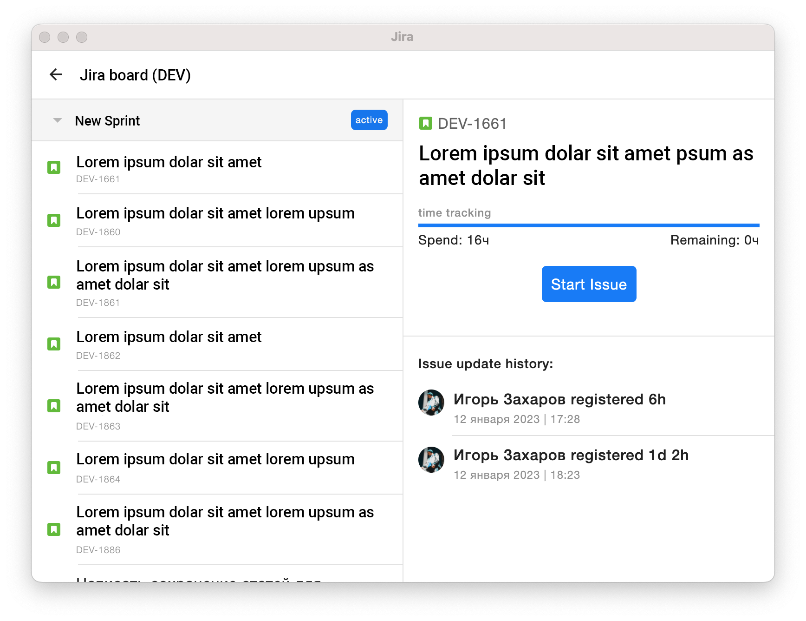

# JiraWorkLogApplication #0.1
Application for tracking the time of work on tasks in jira

## Features
In fact, this is a timer that needs to be turned on before the task is completed and turned off after.
The application itself will send a request to update the time to the server.

> If you notice an error while using the application, do you have any ideas for
new updates or just have questions, be sure to [post it](https://github.com/tompadz/JiraWorkLogApplication/issues),
this is the only way I can answer this quickly

## Installation

### Windows and Linux

Well, it's too easy. [Download](https://github.com/tompadz/JiraWorkLogApplication/releases) and install the latest app....enjoy!

### MacOS

Unfortunately, apple 💩  was forbidden to install unlicensed programs on new versions of MacOS,
so until I pay $ 99 (and I don’t pay), the program will not be installed.

However! You can build the project yourself, for this you need to download the latest version
[IntelliJ IDEA](https://www.jetbrains.com/idea/), clone this project and run the build.
Not a very fast and convenient way, but it is the only one (

## License

[GPL-3.0 license](https://github.com/tompadz/JiraWorkLogApplication/blob/master/LICENSE)

